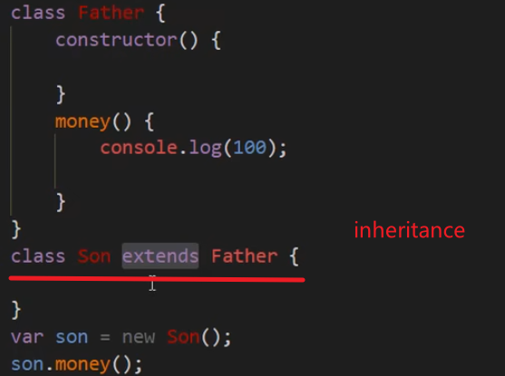
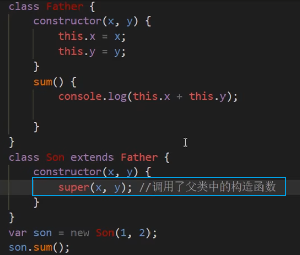

# TYPESCRIPT LEARNING

## What is Typescript?

Typescript is a powerful compiler~编译器~ building up on javascript, It adds new features + advantages to javascript. It makes write javascript easier.

**BUT brower can't execute it.**


## Install Typescript

1.npm init

2.npm install --save-dev lite-server


3.


4.tsc --init    生成tscfig.json文件

 "rootDir": "./src",    

"outDir": "./dist",  

 "noEmitOnError": true 


5.npm start


## Core Types


###Tuple

**元组 Pre-defined length and types for each index.**


### Enum:枚举 

**Special class that represents a group of constants. (unchangable variables)**


### Union Types: 

**When a value can be more than a single type.**


### Type Alias Custom Types


### Function type ->callback


### Throw error


#Compling the project multiple files


### Exclude Files


# ES6

### Const vs Let vs Var

**const** can not be changed, if you would try to assign a new value here, you will get an error.

```javascript
const userName = "Olivia";
userName = "Chen"  //错的 错的 错的
```

**let ** is a variable which can be changed. Block scope: a snippet~片段~ surrounded with curly braces in a (if statement / for loop / function), any variable defined in there would be available in that block.

```javascript
function add(a:number,b:number){
    let result;
    result = a + b;
    return result;
}
console.log(result);  // 可以


let result; //可以
function add(a:number,b:number){
    result = a + b;
    return result;
}
console.log(result); 
```


**var** global and a function scope.

```javascript
function add(a:number,b:number){
    var result;
    result = a + b;
    return result;
}
console.log(result);  //错的 coz It's only available in the function.


var result; //Defined outside the function!
function add(a:number,b:number){
    result = a + b;
    return result;
}
console.log(result); //可以 Defined outside the function, coz it's globally.
```


# Class

## Create a basic Class


## Inheritance



## super 

Calls the base constructor, it can take the argument of the base constructor 



## Getters and Setters

Getters: We can read the *fullName* like a **property**.


Setters:We can set it from the outside.


